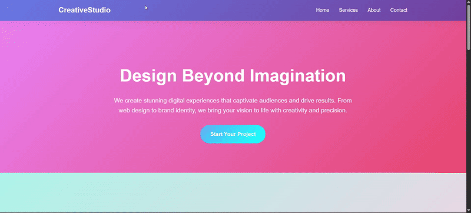
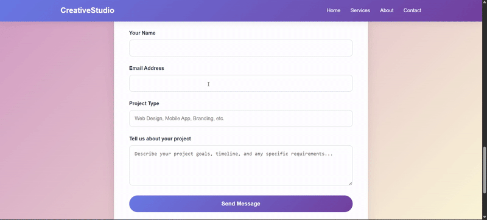

# CENG-3507 Web Geliştirme Vize Projesi

Bu proje, "Creative Studio" adında kurgusal bir ajans için HTML5 ve CSS3 kullanılarak oluşturulmuş, duyarlı (responsive) bir açılış sayfasıdır. CENG-3507 Web Geliştirme ve Programlama dersi vize ödevi olarak hazırlanmıştır.

## 🛠️ Kullanılan Teknolojiler

## 🚀 Çalıştırma

1.  Depoyu klonlayın: `git clone (https://github.com/barisberisbek/responsive-landing-page)`
2.  `CreativeStudio.html` dosyasını tarayıcınızda açın.

---
**Hazırlayan:** Barış BERİŞBEK
